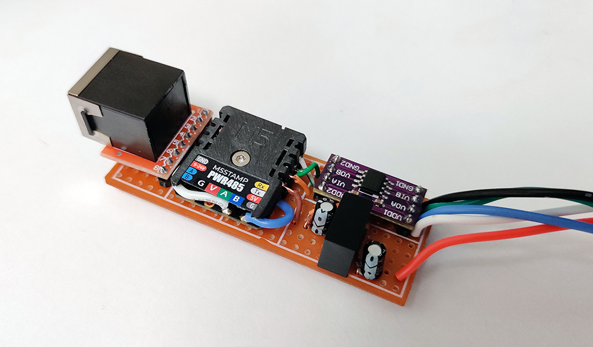
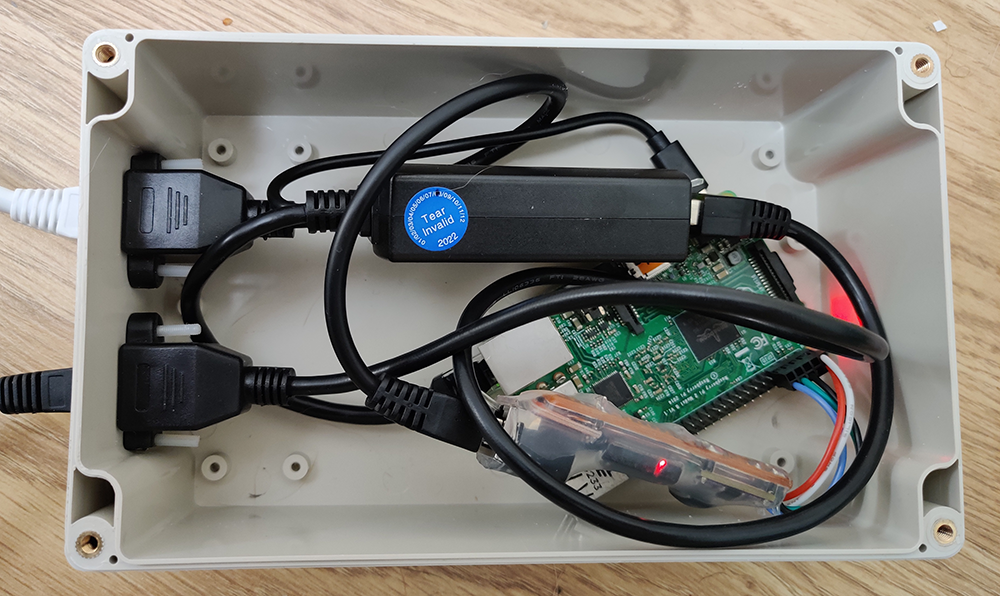
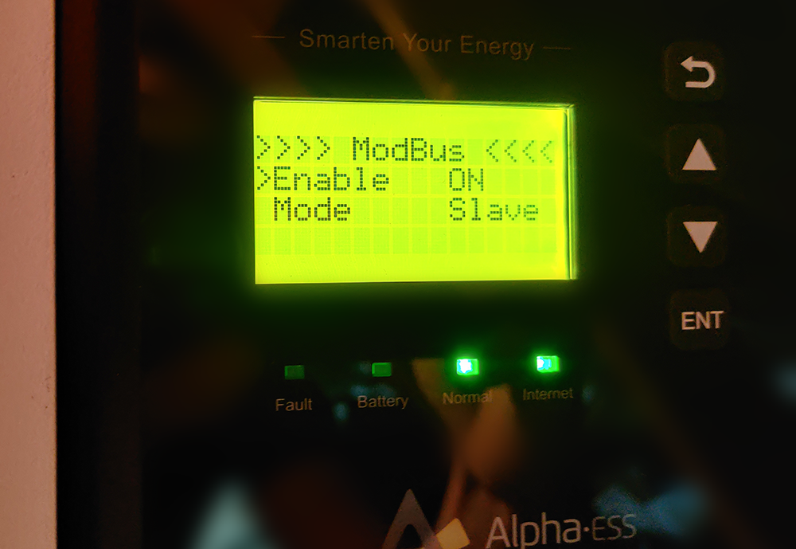
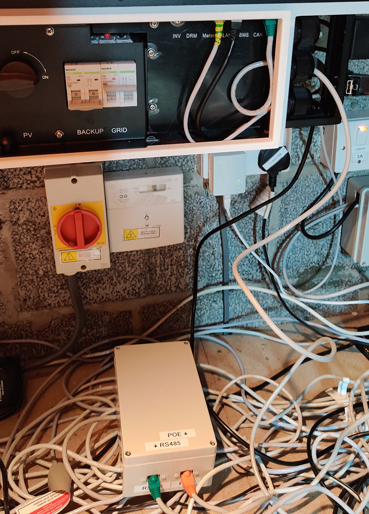

# AlphaESS ModBus reader

Async Python 3 library to read ModBus from an AlphaESS inverter.

Uses [asynciominimalmodbus](https://github.com/guyradford/asynciominimalmodbus).

Compatible with:

| **Device**  | **Baud** | **Tested** |
|-------------|----------|------------|
| SMILE5      | 9600     |      ✅     |
| SMILE-B3    | 9600     |            |
| SMILE-T10   | 9600     |            |
| Storion T30 | 19200    |            |

## Hardware

⚠️⚠️ This worked for me, so do at your own risk!! ⚠️⚠️

More information (and pictures) in the [Notes](#my-setup) section below.

- Use the inverter menu to enable modbus in slave mode.
- Snip one end of an ethernet cable off and connect (may vary):
    - Blue/white to RS485 A
    - Blue to RS485 B    
    - RS485 RX to GPIO 15
    - RS485 TX to GPIO 14
- Enable serial port on Raspberry Pi with `raspi-config`.
- Connect other end of ethernet cable to the inverter CAN port.

## Quick start

Clone repo and run `example.py`:

``` bash
git clone git@github.com:SorX14/alphaess_modbus.git
cd ./alphaess_modbus
./example.py
```

``` bash
[Sun, 20 Nov 2022 21:36:54] INFO [example.py.main:27] PV: 0W GRID: 1078W USE: 1078W Battery: 0W
```

Done! 🎉

## Architecture

This library concentrates on reading data, but [writing](#writing-values) is possible.

Uses a JSON definition file containing all the ModBus registers and how to parse them - lookup the register you want from the [PDF](https://www.alpha-ess.de/images/downloads/handbuecher/AlphaESS-Handbuch_SMILET30_ModBus_RTU_V123-DE.pdf) and request it using the reader functions below.

For example, to get the capacity of your installed system, find the item in the PDF:


Copy the name - `PV Capacity Storage` - and request with `.get_value("PV Capacity Storage")`

### Definitions

``` json
  ...
  {
    "name": "pv2_current",
    "address": 1058,
    "hex": "0x0422",
    "type": "register",
    "signed": false,
    "decimals": 1,
    "units": "A"
  },
  ...
```

called with:

``` python
await reader.get_value("PV2 current") # or await reader.get_value("pv2_current")
```

will read register `0x0422`, process the result as unsigned, divide it by 10, and optionally add `A` as the units.

The default JSON file was created with [alphaess_pdf_parser](https://github.com/SorX14/alphaess_pdf_parser). You can override the default JSON file with `Reader(json_file=location)`

## Reading values

### `Reader()`

Create a new reader

``` python
import asyncio
from alphaess_modbus import Reader

async def main():
    reader: Reader = Reader()

    definition = await reader.get_definition("pv2_voltage")
    print(definition)

asyncio.run(main())
```

Optionally change the defaults with:

- `decimalAddress=85`
- `serial='/dev/serial0'`
- `debug=False`
- `baud=9600`
- `json_file=None`
- `formatter=None`

### `get_value(name) -> int`

Requests a value from the inverter.

``` python
grid = await reader.get_value("total_active_power_grid_meter")
print(grid)

# 1234
```

Prints the current grid usage as an integer.

### `get_units(name) -> str`

Get units (if any) for a register name.

``` python
grid_units = await reader.get_units("total_active_power_grid_meter")
print(grid_units)

# W
```

### `get_formatted_value(name, use_formatter=True)`

Same as `get_value()` but returns a string with units. If a [formatter](#formatters) is defined for the register, a different return type is possible.

``` python
grid = await reader.get_formatted_value("total_active_power_grid_meter")
print(grid)

# 1234W
```

Set `use_formatter` to `False` to prevent a formatter from being invoked.

### `get_definition(name) -> dict`

Get the JSON entry for an item. Useful if you're trying to [write](#writing-values) a register.

``` python
item = await reader.get_definition("inverter_power_total")
print(item)

# {'name': 'inverter_power_total', 'address': 1036, 'hex': '0x040C', 'type': 'long', 'signed': True, 'decimals': 0, 'units': 'W'}
```

## Formatters

Some registers are special not just simple numbers - they could contain ASCII, hex-encoded numbers or another format.

For example, `0x0809` `Local IP` returns 4 bytes of the current IP, e.g. `0xC0，0xA8，0x01，0x01` (`192.168.1.1`).

To help, there is a built-in formatter which will be invoked when calling `.get_formatted_value()` e.g:

``` python
ip = await reader.get_formatted_value("Local IP")
print(ip)

# 192.168.0.1
```

Not all registers have a formatter, and you might have a preference on how the value is returned (e.g. time-format). To help with this, you can pass a `formatter` to `Reader()` and override or add to the default:

``` python

class my_custom_formatter:
  def local_ip(self, val) -> str:
    bytes = val.to_bytes(4, byteorder='big')
    return f"IP of device: {int(bytes[0])} - {int(bytes[1])} - {int(bytes[2])} - {int(bytes[3])}"

reader: Reader = Reader(formatter=my_customer_formatter)

local_ip = await reader.get_formatted_value("local_ip")
print(local_ip)

# IP of device: 192 - 168 - 0 - 0
```

Each formatting function is based on the conformed name of a register. You can find the conformed name of a register by searching `registers.json` or by using `await reader.get_definition(name)`

## Writing values

☠️ ModBus gives full control of the inverter. There are device-level protections in place but be very careful ☠️

This library is intended to read values, but you can get a reference to the  [internal ModBus library](https://pypi.org/project/AsyncioMinimalModbus/) with `reader.instrument`:

``` python
read = await reader.instrument.read_long(int(0x0021), 3, False)
print(read)
```

Read the library docs for what to do next: https://minimalmodbus.readthedocs.io/en/stable/

Use the [AlphaESS manual](https://www.alpha-ess.de/images/downloads/handbuecher/AlphaESS-Handbuch_SMILET30_ModBus_RTU_V123-DE.pdf) for how each register works.

## Notes

### Definitions

While [my parsing script](https://github.com/SorX14/alphaess_pdf_parser) did its best, there are likely to be many faults and missing entries. I only need a few basic registers so haven't tested them all.

Some registers are longer than the default 4 bytes and won't work- you'll have to use the internal reader instead.

PR's are welcome 🙂

### Registers always returning 0

There are a lot of registers, but they might not all be relevant depending on your system setup. For example, the PV meter section is useless if your AlphaESS is in DC mode. 

### Error handling

I've had the connection break a few times while testing, make sure you handle reconnecting correctly. `example.py` will output the full exception should one happen.

### My setup

I used a [m5stamp RS485 module](https://shop.m5stack.com/products/m5stamp-rs485-module) with a digital isolator and DC/DC isolator.



Installed in an enclosure with a PoE adapter to power the Pi and provide connectivity.



Enabled ModBus interface on the inverter. You'll need the service password, mine was set to the default of `1111`.



Then connected to the CAN port.



# Credit and thanks

Special thanks go to https://github.com/CharlesGillanders/alphaess where I originally started
playing around with my PV system. Their project uses the AlphaESS dashboard backend API to unofficially get inverter values from the cloud.

Invaluable resource for discussing with other users. Highly
recommend reading https://github.com/CharlesGillanders/alphaess/issues/9 which ended up with
AlphaESS creating an official API to retrieve data - https://github.com/alphaess-developer/alphacloud_open_api

Another great resource is https://github.com/dxoverdy/Alpha2MQTT which uses a ESP8266 instead
of a Raspberry PI to communicate with the inverter - again - highly recommended.